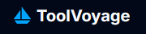
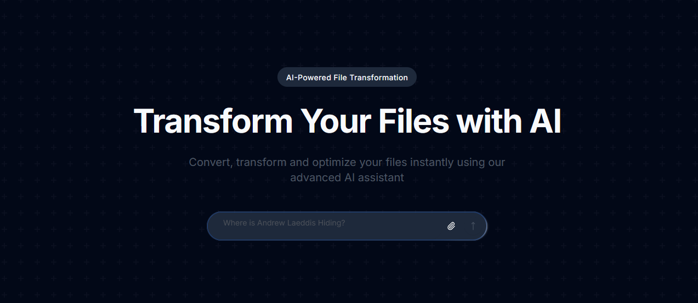

<a id="readme-top"></a>

<br />
<div align="center">
  <a href="https://github.com/axelwesselgren/toolvoyage-public">
    
  </a>

<h3 align="center">ToolVoyage</h3>

  <p align="center">
    The public and open-source repository of ToolVoyage meant for viewing the source-code
  </p>
</div>

### ⚠️ Disclaimer

**This project is a work in progress**

## About The Project



A full-stack web application for manipulating and working with files using AI. Written in TypeScript with the use of Next.js as the main framework

<p align="right">(<a href="#readme-top">back to top</a>)</p>

## Built With

These are some of the major parts of this project, it consists of way more frameworks and languages, just not mentioned here.


<p align="right">(<a href="#readme-top">back to top</a>)</p>

## Getting Started

Follow these steps to set up the project locally install the required dependencies.

### Prerequisites

Make sure you have Node.js installed. You can check with:

```sh
node -v
```

### Instructions

1. **Clone the repository**
   ```sh
   git clone https://github.com/axelwesselgren/toolvoyage-public.git
   cd toolvoyage-public
   ```

2. **Install node packages**
   ```sh
   npm i
   ```
4. **Fill out the .env file**
   ```env
    BETTER_AUTH_SECRET=
    BETTER_AUTH_URL=
    
    AUTH_GOOGLE_ID=
    AUTH_GOOGLE_SECRET=
    
    AUTH_RESEND_KEY=
    
    DATABASE_URL=
    
    AUTH_GITHUB_ID=
    AUTH_GITHUB_SECRET=
    
    NEXT_PUBLIC_APP_URL=
   ```

3. **Start the server**
   ```sh
   npm run dev
   ```

You're now ready to run the application!

<p align="right">(<a href="#readme-top">back to top</a>)</p>

## Roadmap

- [ ] Complete project
- [ ] Add proper documentation
- [ ] Restructure project to adhere to modern practices

See the [open issues](https://github.com/axelwesselgren/toolvoyage-public/issues) for a full list of proposed features (and known issues).

<p align="right">(<a href="#readme-top">back to top</a>)</p>

## License

**⚠️ This project is for educational and personal use only.**

Commercial use is NOT permitted under the terms of the license.  
See `LICENSE file for more details.

<p align="right">(<a href="#readme-top">back to top</a>)</p>
